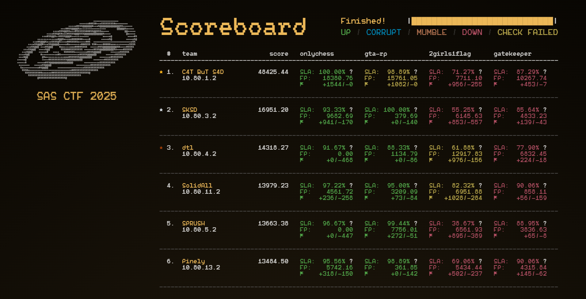
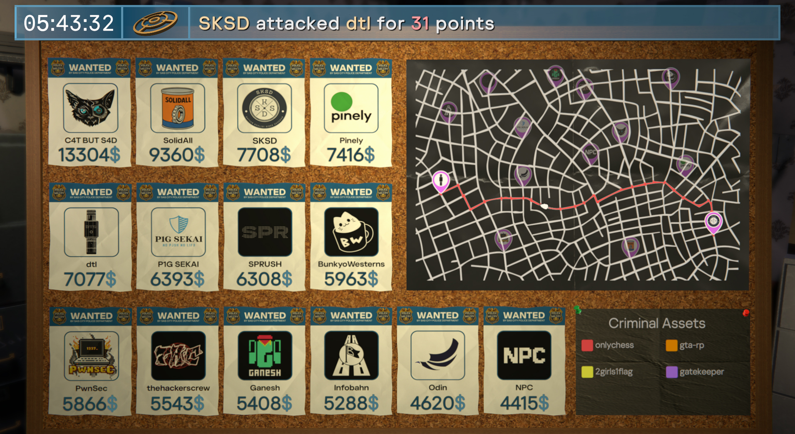

# SAS CTF 2025 Finals

This repository contains services, checkers and writeups from the onsite Attack-Defense finals of SAS CTF 2025 that took place in Khao Lak, Thailand on October 26, 2025

https://ctf.thesascon.com/finals \
https://ctftime.org/event/2811

**Duration:** 8.5 hours

## Partners
- [Kaspersky Academy](https://academy.kaspersky.com/)
- [Yandex.Cloud](https://yandex.cloud/en/)
- [OtterSec](https://osec.io/)
- [Drovosec](https://drovos.ec)

## Organization team
**Lead:** [@bzvr](https://github.com/bzvr) \
**DevOps:** [@kochanac](https://github.com/kochanac) \
**Frontend:** [@kumfc](https://github.com/kumfc) (PASECA Sans by [@twosd](https://t.me/twosd)) \
**Game visualization:** [@WeeqnMain](https://github.com/WeeqnMain), [@kumfc](https://github.com/kumfc)

[ForcAD](https://github.com/pomo-mondreganto/ForcAD/) was used as a checksystem and backend core

## Tasks

| Name | Category | Stack | Authors |
|------|----------|-------|---------|
|[onlychess](onlychess)|web, crypto|Golang|[@kochanac](https://github.com/kochanac), [@Nazacod](https://github.com/Nazacod), [@oda02](https://github.com/oda02)|
|[gta-rp](gta-rp)|minecraft|Java, Haskell, PaperMC|[@3vilWind](https://github.com/3vilWind), [@irdkwmnsb](https://github.com/irdkwmnsb)|
|[2girls1flag](2girls1flag)|AI|Python, Agno|[@kumfc](https://github.com/kumfc), [@MaksTresh](https://github.com/MaksTresh), art by [@yeuyes](https://twitter.com/yeuyes)|
|[gatekeeper](gatekeeper)|pwn, crypto|C, Python, QEMU|[@m4drat](https://github.com/m4drat), [@b1ad3runn3r](https://github.com/b1ad3runn3r), [@try-h4rder](https://github.com/try-h4rder)|
